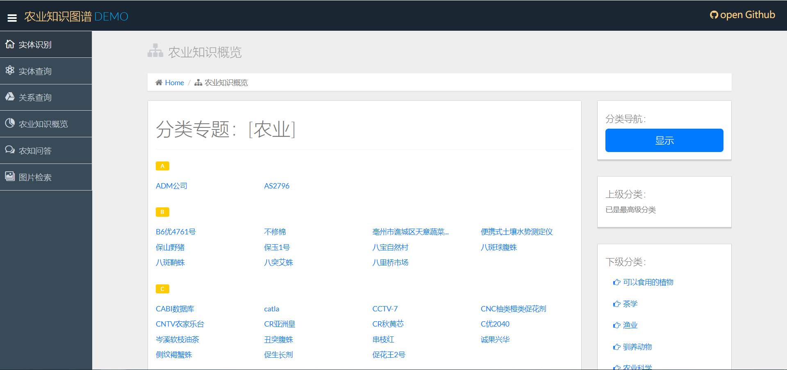
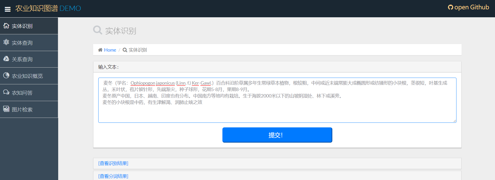
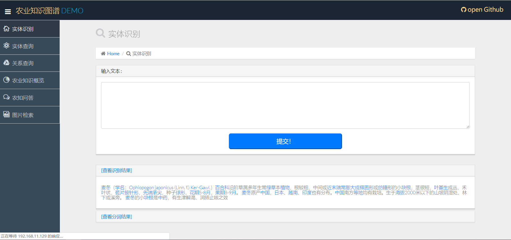

# Agricultural Knowledge Graph


## 项目介绍：

本项目是 基于华东师范大学农业知识图谱开源项目之上，二次开发，遵循GPL-3.0协议

> 项目源地址：[点击此处](https://github.com/qq547276542/Agriculture_KnowledgeGraph)


## 目录结构：

```
.
├── MyCrawler      // scrapy爬虫项目路径(已爬好)
│   └── MyCrawler
│       ├── data
│       └── spiders
├── data\ processing    // 数据清洗(已无用)
│   └── data
├── demo     // django项目路径
│   ├── Model  // 模型层，用于封装Item类，以及neo4j和csv的读取
│   ├── demo   // 用于写页面的逻辑(View)
│   ├── label_data    // 标注训练集页面的保存路径
│   │   └── handwork
│   ├── static    // 静态资源
│   │   ├── css
│   │   ├── js
│   │   └── open-iconic
│   ├── templates   // html页面
│   └── toolkit   // 工具库，包括预加载，命名实体识别
│   └── KNN_predict   
├── KNN_predict    // KNN算法预测标签
├── dfs_tree_crawler     // 爬取互动百科农业实体树形结构的爬虫
└── wikidataSpider    //  爬取wiki中的关系
```


## 可复用资源

- hudong_pedia.csv : 已经爬好的农业实体的百科页面的结构化csv文件
- labels.txt： 5000多个手工标注的实体类别
- predict_labels.txt:  KNN算法预测的15W多个实体的类别
- /wikidataSpider/wikidataProcessing/wikidata_relation.csv: predict_labels.txt中实体在wikidata中对应的三元组关系
- attributes.csv: 部分实体的属性(互动百科页面中直接得到)
- wikidataSpider/weatherData/static_weather_list.csv： 气候类型列表
- wikidataSpider/weatherData/weather_plant.csv：气候与植物的种植关系
- wikidataSpider/weatherData/city_weather.csv：城市与气候的关系


## 项目配置

**0.安装基本环境：**

ubuntu16.04 LST64位系统，注意不要低于这个版本，比如ubuntu14.04。因为该系统自带的python3版本为3.4  而该系统要求的Django需要python3.5以上的版本。ubuntu16.04默认自带python3.5(~~一夜没睡的教训~~)

1）安装jdk1.8 （为后面Neo4j做铺垫）
安装步骤参考：[ubuntu下安装jdk](https://blog.csdn.net/huixingshao/article/details/68951631?utm_source=blogxgwz3  )

2）安装Neo4j，详细参考[点击此处](https://blog.csdn.net/u013946356/article/details/81736232)

（memory_size等会设置，暂时默认512m，后续导入数据时改为2g左右即可，数据导入完毕后，需要改回来）


3）安装pip3

> sudo apt-get install python3-pip

4）安装其他的依赖库

> sudo pip3 install -r requirement.txt

( requirement.txt 已更新)


**1.导入数据：**

该项目已经将原来需要导入的数据全都导入到相关的目录下，接着需要执行如下步骤

`启动Neo4j`

这里需要先将 dbms.memory.heap.initial_size 和dbms.memory.heap.max_size调大点，比如2g足够，导入完成后需要把值改回去


```
// 将hudong_pedia.csv 导入
LOAD CSV WITH HEADERS  FROM "file:///hudong_pedia.csv" AS line  
CREATE (p:HudongItem{title:line.title,image:line.image,detail:line.detail,url:line.url,openTypeList:line.openTypeList,baseInfoKeyList:line.baseInfoKeyList,baseInfoValueList:line.baseInfoValueList})  

// 新增了hudong_pedia2.csv
LOAD CSV WITH HEADERS  FROM "file:///hudong_pedia2.csv" AS line  
CREATE (p:HudongItem{title:line.title,image:line.image,detail:line.detail,url:line.url,openTypeList:line.openTypeList,baseInfoKeyList:line.baseInfoKeyList,baseInfoValueList:line.baseInfoValueList})  
```
```
// 创建索引
CREATE CONSTRAINT ON (c:HudongItem)
ASSERT c.title IS UNIQUE
```

以上两步的意思是，将hudong_pedia.csv导入neo4j作为结点，然后对titile属性添加UNIQUE（唯一约束/索引）

接着执行以下语句

```
// 导入新的节点
LOAD CSV WITH HEADERS FROM "file:///new_node.csv" AS line
CREATE (:NewNode { title: line.title })

//添加索引
CREATE CONSTRAINT ON (c:NewNode)
ASSERT c.title IS UNIQUE

//导入hudongItem和新加入节点之间的关系
LOAD CSV  WITH HEADERS FROM "file:///wikidata_relation2.csv" AS line
MATCH (entity1:HudongItem{title:line.HudongItem}) , (entity2:NewNode{title:line.NewNode})
CREATE (entity1)-[:RELATION { type: line.relation }]->(entity2)

LOAD CSV  WITH HEADERS FROM "file:///wikidata_relation.csv" AS line
MATCH (entity1:HudongItem{title:line.HudongItem1}) , (entity2:HudongItem{title:line.HudongItem2})
CREATE (entity1)-[:RELATION { type: line.relation }]->(entity2)
```

**导入实体属性(数据来源: 互动百科)**


```cypher
LOAD CSV WITH HEADERS FROM "file:///attributes.csv" AS line
MATCH (entity1:HudongItem{title:line.Entity}), (entity2:HudongItem{title:line.Attribute})
CREATE (entity1)-[:RELATION { type: line.AttributeName }]->(entity2);

LOAD CSV WITH HEADERS FROM "file:///attributes.csv" AS line
MATCH (entity1:HudongItem{title:line.Entity}), (entity2:NewNode{title:line.Attribute})
CREATE (entity1)-[:RELATION { type: line.AttributeName }]->(entity2);

LOAD CSV WITH HEADERS FROM "file:///attributes.csv" AS line
MATCH (entity1:NewNode{title:line.Entity}), (entity2:NewNode{title:line.Attribute})
CREATE (entity1)-[:RELATION { type: line.AttributeName }]->(entity2);

LOAD CSV WITH HEADERS FROM "file:///attributes.csv" AS line
MATCH (entity1:NewNode{title:line.Entity}), (entity2:HudongItem{title:line.Attribute})
CREATE (entity1)-[:RELATION { type: line.AttributeName }]->(entity2)  

//我们建索引的时候带了label，因此只有使用label时才会使用索引，这里我们的实体有两个label，所以一共做2*2=4次。当然，可以建立全局索引，即对于不同的label使用同一个索引
```

**导入气候名称:**


```
//导入节点
LOAD CSV WITH HEADERS FROM "file:///static_weather_list.csv" AS line
MERGE (:Weather { title: line.title })

//添加索引
CREATE CONSTRAINT ON (c:Weather)
ASSERT c.title IS UNIQUE
```

**导入气候与植物的关系**

```

//导入hudongItem和新加入节点之间的关系
LOAD CSV  WITH HEADERS FROM "file:///weather_plant.csv" AS line
MATCH (entity1:Weather{title:line.Weather}) , (entity2:HudongItem{title:line.Plant})
CREATE (entity1)-[:Weather2Plant { type: line.relation }]->(entity2)


(导入city_weather.csv这步大约需要15分钟左右)
//导入城市对应的气候
LOAD CSV WITH HEADERS FROM "file:///city_weather.csv" AS line
MATCH (city{title:line.city}) , (weather{title:line.weather})
CREATE (city)-[:CityWeather { type: line.relation }]->(weather)
```


以上步骤是导入爬取到的关系


**2.下载词向量模型：（如果只是为了运行项目，步骤2可以不做，预测结果已经离线处理好了）**

~~http://s3-us-west-1.amazonaws.com/fasttext-vectors/wiki.zh.zip  
  将wiki.zh.bin放入 KNN_predict 目录 。~~


**3.修改Neo4j用户**

进入demo/Model/neo_models.py,修改第9行的neo4j账号密码，改成你自己的（此处密码为：123456）

**4.启动服务**

进入demo目录，然后运行脚本：

```
sudo sh django_server_start.sh
```

这样就成功的启动了django。我们进入8000端口主页面，输入文本，即可看到以下命名实体和分词的结果（确保django和neo4j都处于开启状态）




----------------------
###  (update 2019.3.4)

测试实体类别

在百度百科上采取一段对 麦冬的介绍  复制粘贴到此处



结果显示




### 未完，待续......
